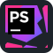
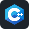

  
  

    <h1 style="color: #7559F8;">Axel is a developer🔥!</h1>
  

  

    <strong>Good afternoon, I'm Axel Polozhentsev</strong>
  

  

    <h2>🌟About Me </h2>
    

      
    

  

  

      

          💻 I work in front-end development and web design, while focusing on data science and AI/ML. 
          🎓 I'm currently studying at the Russian University of Chemical Technology. 
          🖥️ I worked on .Net Framework and Hands-on experience in Full Stack. 
          ❓ Ask me about PHP, Full Stack Development, Python.  
          🤖 Interest in Artificial Intelligence, Machine Learning, Deep Learning, Data Science, Automation. 
          🎯 I like to constantly learn new things. 
      

      

        
      

  

  

    <h3>Follow Me on:</h3>
  

  

    

      
      
      
      <!--  -->
    

  

  

    <h2></> Languages & tools I Have placed My Hands On</h2>
  

  

    

      
      
      
      
      
      
      
      
      
    

    

      
      
      
    

  

