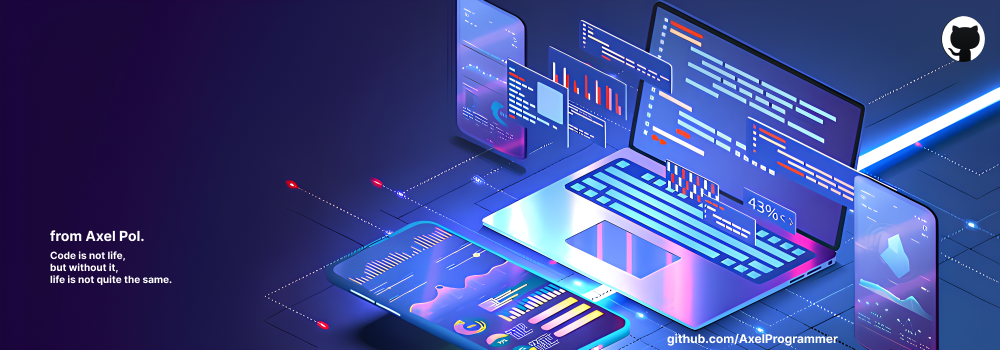

  
  

    <h1 style="color: #7559F8;">Axel is a developer🔥!</h1>
  

  

    <strong>Good afternoon, I'm Axel Polozhentsev</strong>
  

  

    <h2>🌟About Me </h2>
    

      
    

  

  

      <ul style="list-style-type: none; padding-left: 0;">
          <li>💻 I work in front-end development and web design, while focusing on data science and AI/ML.</li>
          <li>🎓 I'm currently studying at the Russian University of Chemical Technology.</li>
          <li>🖥️ I worked on .Net Framework and Hands-on experience in Full Stack.</li>
          <li>❓ Ask me about PHP, Full Stack Development, Python. </li>
          <li>🤖 Interest in Artificial Intelligence, Machine Learning, Deep Learning, Data Science, Automation.</li>
          <li>🎯 I like to constantly learn new things.</li>
      </ul>
      
  

  

    <h3>Follow Me on:</h3>
  

  

    

      
      
      
      <!--  -->
    

  

